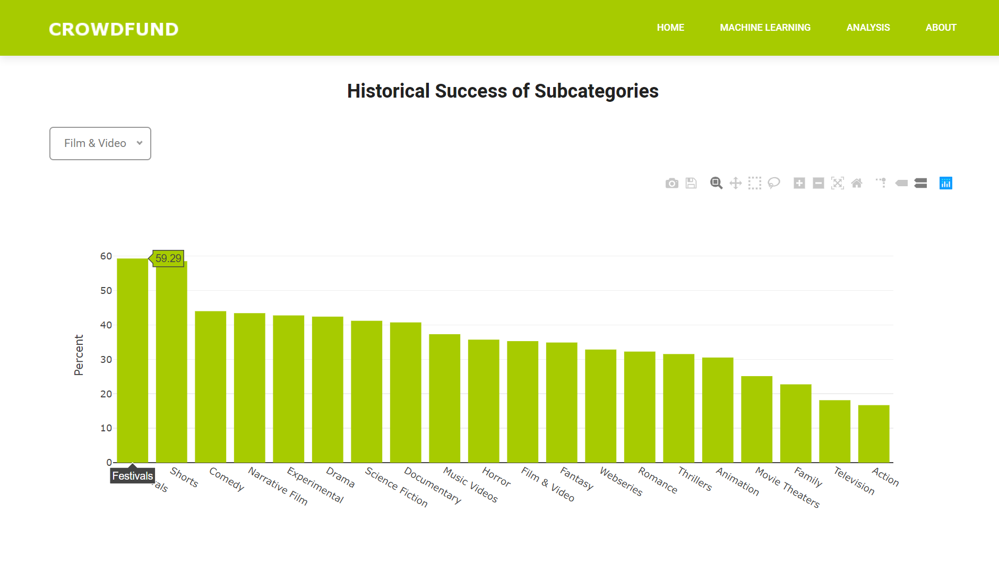
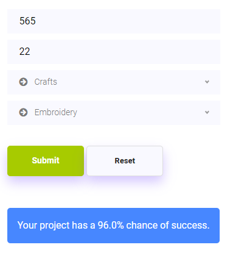

# **CROWDFUND**

### **Crowdfund is a full-stack app that uses machine learning to predict the likelihood of a project successfully receiving funding from online crowdfunding platforms.**

## Overview

#### Users can use this app to 1) find a reasonable monetary goal based on the number of people they plan to reach, or 2) implement a more aggressive marketing strategy if their goal is fixed but the number of expected backers is too low to ensure success.

## Inspiration

#### The Crowdfund app was built as a tool for people who plan to fund their projects through online crowdfunding resources like Kickstarter or IndieGoGo. 

#### The Crowdfund app utilizes Gradient Boosting, a machine learning technique, to create a predictive model. Using Kickstarter data, our goal is to determine a likelihood of receiving sufficient funding for a project.

## Tech Used

### *Python, Pandas, SQLite, Flask, Gradient Boosting, JavaScript, D3, Bootstrap, HTML, CSS*

---

## Data Analytics Team

### Eugene Miao    	(https://github.com/eugenemiao)
### Laura Raynes	(https://github.com/lraynes)
### Marianna Mangat	(https://github.com/mariannamangat)
### Norman Steele 	(https://github.com/normcsteele)
